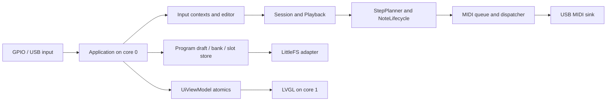

# Current firmware architecture (after R5)

This describes the code on `codex/refactor-feature-foundation`. Future feature contracts live in [`docs/features/`](../features/implementation-order.md).

## Composition and ownership

`src/main.cpp` contains only the Arduino `setup`, `loop`, `setup1` and `loop1` entry points. A single `Application` in `src/application.{h,cpp}` constructs the hardware adapters and connects the input, engine, storage, diagnostics and UI snapshot components. This is board-level composition, not a domain model.

| Layer | Owns / does | Boundary |
| --- | --- | --- |
| `src/drivers/`, `lib/` | USB MIDI, Pico timer, LittleFS, display/LVGL and reusable input drivers | Hardware-specific work stays out of the native domain code. |
| `src/input/` | Button/encoder event conversion, contexts, editing and dialog coordination | It invokes domain operations; it does not own transport time or LVGL objects. |
| `src/program/` | Persisted `Program`, optional-source `ProgramDraft`, revisioned `ProgramBank`, codec, A/B slot store and storage controller | No playback cursor or accepted MIDI-note state in `Program`. |
| `src/engine/` | `Session`, `Playback`, `Sequencer`, `StepPlanner`, `NoteLifecycle`, transport, queue and delivery | No display or flash I/O in the timing path. |
| `src/components/` and GUI | `UiSettings` snapshot, atomic `UiViewModel`, LVGL presentation | GUI reads snapshots on core 1; core 0 does not access LVGL. |

`Application` owns one `Session`, one `ProgramBank`, one `ProgramDraft` and the storage controller. A `Program` is the saved 16-step value plus initial tempo, swing, volume and clock mode. `ProgramId` identifies user slots 0–15; slot 16 is current autosave and has no ID. Saving a user slot refreshes its RAM bank entry, while loading selects a playable program and draft. `Session` owns the common tempo/clock settings, one `Playback` and one `TransportController`. `Playback` owns its applied `Sequencer`, scheduling cursor and note lifecycle through that sequencer, plus an optional selected `ProgramId`. The bank is not yet a source for multiple playing tracks.

The dependency direction is composition → input/program/engine abstractions → hardware adapters at the edges. Domain code must not depend on Arduino, LittleFS, USB or LVGL. `Application` is the deliberate composition exception: it knows both the domain and concrete adapters.

## Input to MIDI and GUI

Core 0 polls USB real-time events and services transport before scheduled matrix and encoder polling. Input adapters produce events; context routing and `AppInputCoordinator` update the editor, session or storage request. Live edits update the applied sequencer; program capture creates a value snapshot for save/autosave. The transport asks `Playback::scheduleThrough`, which forwards to `Sequencer` and `StepPlanner`. The planner walks sixteenth-note boundaries with a short lookahead, applies swing and gate, and enqueues Note On/Off requests for enabled steps. The MIDI queue orders due events; `MidiDispatcher` retries delivery through the USB sink and records acceptance. `NoteLifecycle` distinguishes requested/projected launches from a Note On actually accepted by the sink, so Stop and replacement Off target the accepted note. Capacity or retry failure can stop transport safely.

The same core builds `UiSettings` from session and editor state and publishes it through `UiViewModel`. Core 1 runs `LvglUi::loop` and reads the latest complete snapshot; it does not read live `Program` or `Sequencer` objects. The atomic generation protocol guards against a torn multi-field view. This is a snapshot channel, not a shared mutable application model.

## Time, cores and storage

Internal clock uses `PicoInternalTickAlarm`/`InternalTickSource`; External mode receives USB MIDI Clock and Start/Continue/Stop through `UsbMidiRealtimeReceiver` and `TransportController`. The modes share one transport and one delivery stream. The current planner sends notes on MIDI channel 0 (user channel 1). Swing changes note positions within pairs; it does not change MIDI Clock pulses. External loss stops transport and requires a new lock and explicit transport action; it does not silently switch to the internal source.

Core 0 owns mutable musical state, transport, physical inputs, USB MIDI polling and storage decisions. Core 1 owns LVGL. Avoid dynamic allocation, display calls, blocking work and flash access in timing-sensitive service paths. In particular, `ProgramStorageController` rejects Save/Load/Reset and autosave while `Session::isRunning()`; LittleFS reads/writes can stall MIDI timing. USB sink acceptance is a local boundary; host delivery and actual sound require separate measurement.

## Native test extension

Keep new pure logic under `src/engine/`, `src/input/` or `src/program/`. Add a new engine `.cpp` explicitly to `env:native` `build_src_filter` in `platformio.ini` (input and program directories are already included). Register every new Unity test entry point in `test/test_native/main.cpp`; the runner does not discover test files automatically. Extend host Python tests under `scripts/tests/` for protocol/report changes. Run `make verify` before treating firmware behavior as unchanged, then perform the device checklist in [R6](../refactoring/r6-final-result.md).
