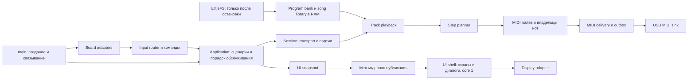

# Swing Metro: макроплан рефакторинга и следующих фич

> Статус: макроплан одобрен пользователем; выбран вариант A. Реализация ещё не начата.
> Согласованный порядок: общий фундамент R0–R6 → длина программы → режимы шага → 16 партий/MIDI → песни.
> Проверено на HEAD `6317513ff61d2de3673c2dc3927b85b2987603b5`, 27 сентября 2026.
> GitNexus: индекс на том же HEAD, создан 2026-09-27T15:20:18.693Z; 237 файлов, 10041 узел, 22097 связей, 194 процесса. PDG доступен. Обновление индекса не требовалось.
> Рабочее дерево перед публикацией плана чистое. Точная привязка исходников — в §11.
> Evidence provenance schema 2; global dirty digest `0a9c85780067d9afcd0764f307b60891e3cee927ee11eaeb5ec7826d10fd82cd`; cited-path manifest: 34 paths; excluded only `docs/plans/2026-09-27-gitnexus-plan-refactor-feature-foundation.md`.
> `[verified]` — проверено по исходникам; `[graph]` — результат GitNexus; `[inferred]` — вывод или проектное предложение; `[assumed]` — предлагаемое правило, требующее продуктового решения.

## 1. Цель и границы

Подготовить понятную архитектуру для режимов шага one-shot/repeat/legato, длины программы 1–16 шагов, песен из ссылок на программы и 16 одновременно играющих партий с пересекающимися наборами MIDI-каналов.

Результат текущей задачи — этот макроплан: обследование проекта, этапы рефакторинга, короткие спецификации фич, проект README и три порядка реализации. Изменения прошивки, удаление старого кода и публикация отдельных README/feature-документов выполняются по этапам ниже. Не смешивать структурный рефакторинг с изменением музыкального поведения в одном изменении.

Пользователь подтвердил: «длина команд» означает **длину программы**, а не длительность отдельного шага. Для документации различаем:

- **Программа / паттерн** — сохранённые музыкальные данные.
- **Партия / track** — независимый экземпляр воспроизведения программы или последовательности программ.
- **MIDI-канал** — адрес получателя, в интерфейсе 1–16, в коде 0–15.
- **Песня** — упорядоченные ссылки на программы и число повторений каждой записи.

16 партий не означают 16 слотов хранения, 16 различных программ или взаимно исключающие MIDI-каналы. Два экземпляра одной программы могут иметь независимые позиции воспроизведения.

## 2. Что работает сейчас

| Область | Подтверждённое состояние | Следствие для плана |
| --- | --- | --- |
| Запуск | [verified] `src/main.cpp:727`: инициализация USB, ввода, хранилища, восстановление программы; `:764`: обслуживание транспорта, ввода, диагностики, UI и сохранения | 822 строки в main — значительная часть прикладной логики находится в entry point |
| Программа | [verified] `src/program/program.h:33`: шаг содержит enabled/note/velocity/gate; `:40`: tempo/swing/volume/clock mode и массив 16 шагов | Сохранённые настройки сессии смешаны с паттерном; режимов, длины и маршрутов пока нет |
| Планировщик | [verified] `src/engine/sequencer.cpp:163`: горизонт 2 тика, индекс modulo 16, одна пара Note On/Off на включённый шаг, MIDI-канал 0 | Нужен отдельный планировщик артикуляции, а не дополнительные ветки во всех потребителях |
| Звучащая нота | [verified] `src/engine/sequencer.h:125`: actual/projected/requested launch принадлежат одному Sequencer | Одновременная игра требует отдельной идентичности партии и владельца ноты |
| Доставка | [verified] `src/engine/transport_controller.h:135`: MidiDispatcher; `:775`: TransportController; в одном файле 1052 строки | Файл объединяет контракт sink, диагностику, очередь доставки, сессии и транспорт |
| Ввод | [verified] `src/input/app_input_coordinator.h:53`: редактирование нот, transport, shift, clock modal, storage modal; `:181`: выполнение операции хранения; `:198`: сборка UI-снимка | Координатор совмещает маршрутизацию, сценарии приложения и состояние диалогов |
| GUI | [verified] `src/drivers/lvgl_ui.h:24`, `src/drivers/lvgl_ui.cpp:5`: драйвер дисплея, экраны, модальные окна, форматирование и кэш отображения | Разделять по ответственности и времени жизни объектов, сохраняя LVGL на core 1 |
| Межъядерный обмен | [verified] `src/components/ui_view_model.h:48`: единая публикация через атомарные поля и generation; `:148`: ручное сравнение полей | Нельзя заменить атомики обычной структурой под одним счётчиком без безопасного владения памятью |
| Хранение | [verified] `src/program/program_storage.h:9`: 16 пользовательских слотов + current; `program_slot_store.cpp:106`: выбор A/B; `:123`: запись другой копии и проверка чтением | Основа надёжного хранения уже есть; переиспользовать, не переписывать |
| Автосохранение | [verified] `src/program/program_storage_controller.cpp:61`: только при остановленном Sequencer и изменении CRC | Для нескольких партий условие должно стать общесессионным |
| Логи | [verified] `src/main.cpp:389`: основная диагностика v4; `scripts/pico_run_protocol.py:153`: приём v2/v3/v4 | Устаревшая совместимость находится преимущественно на стороне компьютера |

[verified] У проекта есть две формы описания шага: `ProgramStep` и `SequencerStep`; копирование выполнено в `src/program/program_runtime.cpp:5` и `:27`. Это небольшие структуры, но их семантическое дублирование будет дорожать с каждой фичей. Напротив, TransportController-файл, AppInputCoordinator и LvglUi действительно объединяют несколько крупных обязанностей. Делить нужно ответственность, а не всякую структуру по размеру.

[verified] Исходная проверка в этой сессии: **337/337 native-тестов**, **43/43 host Python-теста**. У native-сборки есть предупреждения об игнорировании `nodiscard` в тестах. Полный `make verify`, ARM-сборки и измерения на железе здесь не выполнялись. Первый запуск native упёрся в доступ к кэшу PlatformIO; повтор с разрешённым доступом завершился успешно.

## 3. Целевая архитектура

[inferred] Сохраняем текущие границы `engine / input / program / drivers`, вводим небольшую область композиции приложения и явно отделяем UI-данные от передачи между ядрами.



Предлагаемые новые типы и файлы ниже — **проектные имена**, их ещё нет в репозитории.

| Объект | Единственная основная ответственность | Чего в нём не должно быть |
| --- | --- | --- |
| `Program` / `StepDefinition` | Данные паттерна, длина, артикуляция, сохранённый маршрут | Указатели LVGL, очереди, состояние звучащих нот |
| `SessionSettings` | Общий tempo и clock mode; политика запуска | Позиции каждой программы |
| `ProgramBank` | Стабильные ProgramId, данные в RAM, ревизии | Чтение flash при запросе следующего шага |
| `TrackPlayback` | ProgramId, локальная позиция, поколение, выбранный маршрут и playback-state одной партии | Создание собственного MIDI clock и дублирование USB stack |
| `StepPlanner` | Музыкальные границы, repeat, legato; намерения нот | Serial, GPIO, LittleFS, LVGL |
| `NoteLifecycle` | Planned/queued/accepted/released, идентичность ноты | Вычисление индекса следующего шага |
| `MidiRouting` / `NoteOwnership` | Размножение намерения по маске каналов; согласование общих нот | Редактирование программы |
| `MidiDelivery` | Retry, сроки, outbox, подтверждение USB acceptance | Сценарии экранов и обращения к одной глобальной программе |
| `TransportController` | Общая временная шкала, start/stop/continue, clock loss | Форматирование CSV, данные модалок |
| `Application` | Порядок обслуживания и координация сценариев | Вторая монолитная копия main |
| `UiSnapshotBuilder` | Данные выбранной партии/страницы и общий статус | Отрисовка и межъядерные атомики |
| `UiViewModel` / mailbox | Согласованный перенос снимка между ядрами | Бизнес-правила редактора |
| `UiShell` | Жизненный цикл экранов и выбор видимого экрана | MIDI и хранение |

Ограничения композиции:

1. Объекты владеют своими состояниями явно; ссылки связываются один раз. Не вводить service locator, контейнер DI или общий event bus без конкретной необходимости.
2. Core 0 изменяет доменные данные; core 1 владеет LVGL. Один UI-снимок публикуется согласованно. В нём только компактные значения, без указателей на изменяемые паттерны.
3. Статическая вместимость партий и очередей; никаких выделений памяти в обработке тика и отправке MIDI. LVGL-объекты создаются на стадии UI setup либо контролируемого перехода.
4. Hardware-independent `.cpp` остаются в `engine/input/program`. Если появится pure application-код в `src/app/`, native `build_src_filter` расширяется явно, исключая board composition. Вынесенные `.cpp` из engine также нужно добавить: сейчас native включает там только sequencer.cpp.
5. Вначале использовать новый playback-контракт с **одной** партией; не реализовывать 16 партий до проверки сохранения прежнего поведения.

## 4. Что показал GitNexus

Навигация выполнена через query по transport/note gate/delivery, GUI/storage и logging; затем context, impact и PDG. Прочитаны ресурсы context, clusters, processes. Обзор процессов отдаёт только верхнюю выборку: это не список всех проверенных потоков.

| Запрос | Результат | Как использовать |
| --- | --- | --- |
| `impact(diagnostics_columns_for_row, upstream, depth=3, includeTests=true)` | [graph] `risk: CRITICAL`, 19 затронутых символов; d1=3, d2=13, d3=3; 6 процессов, 2 модуля | Самостоятельный этап изменения protocol/report/tests, не удаление «по имени v2» |
| `impact(TransportController, Class, upstream, depth=3)` | [graph] LOW; d1=4, d2=1 | Это преимущественно импорты общего заголовка, а не доказательство низкого риска runtime |
| `impact(MidiDispatcher, Class, upstream, depth=3)` | [graph] LOW; те же импорты | Сначала выделение контрактов и диагностики, потом изменение lifecycle |
| `impact(AppInputCoordinator, Class, upstream, depth=3)` | [graph] LOW; main как d1 | Context дополнительно показывает тесты координатора и step-button integration |
| `impact(LvglUi, Class, upstream, depth=3)` | [graph] LOW; main и lvgl_ui.cpp как d1 | Учесть callbacks и core 1, которые одним импортным графом не описываются |
| `impact(Program, Struct, upstream, depth=3)` | [graph] UNKNOWN, «No callers resolved» | Текстовая проверка нашла codec/runtime/store/controller и тесты; нулевой граф не означает отсутствие потребителей |
| `impact(scheduleThrough, sequencer.cpp, upstream, depth=3, includeTests=true)` | [graph] UNKNOWN, «No callers resolved» | Исходник transport_controller.h:967 и тесты sequencer подтверждают вызовы; declaration/definition в C++ представлены раздельно |

Все прямые зависимости d1, которые необходимо учесть:

- Парсер: `diagnostics_header_for_row`, `parse_diagnostics_row` в `scripts/pico_run_protocol.py`; `TimedRunCapture.consume` в `scripts/pico_run_report.py`. Транзитивно затрагиваются MIDI/serial collectors и external-clock validation.
- Оба крупных engine-класса: `src/drivers/usb_midi_adapter.h`, `src/engine/fault_midi_message_sink.h`, `src/input/app_input_coordinator.h`, `src/main.cpp`. Второй уровень: `src/input/fault_command_parser.h`. Context также указывает `test/test_native/engine/test_transport_controller.cpp`.
- Координатор: `src/main.cpp`; тесты из context — `test/test_native/input/test_app_input_coordinator.cpp`, `test/test_native/input/test_step_button_integration.cpp`.
- GUI: `src/main.cpp`, `src/drivers/lvgl_ui.cpp`.

[graph] Индекс содержит runner identity schema 4, CLI 1.6.12, путь distribution и хеши build/runtime; resource сообщает `runner_identity_schema_status: current`. Индекс не обновлялся; вся dependency-runtime provenance заново не пересчитывалась. Индекс совпадает с HEAD, но не является доказательством полноты C++ call graph. LOW по классу не снижает оценку риска изменения MIDI lifecycle. Перед каждым реальным symbol edit — новый impact на конкретную функцию/тип; перед коммитом — полный detect_changes, без partial/truncated.

## 5. PDG и ограничения порядка действий

PDG-запрос `controls` для `src/engine/sequencer.cpp` вернул 66 связей без усечения; для `src/engine/transport_controller.h` — 190. Из них для плана отобраны следующие ограничения. Запрос по одному имени scheduleThrough сначала был неоднозначен между декларацией и определением, поэтому уточнён файлом.

- [verified][graph] `Sequencer::scheduleThrough`, строки 166–194: stopped/completed прекращает планирование; enabled разрешает создание пары; неуспешный enqueue возвращает управление **до** изменения launchId и позиции. Новые repeat/fan-out нельзя частично зафиксировать без явного состояния продолжения.
- [verified][graph] Строки 199–204: насыщение счётчика завершает планирование; инкремент `_nextBoundaryTick` подаётся обратно в горизонт, индекс и позиции событий. `pdg_query(flows, variable=_nextBoundaryTick)` вернул 5 связей. Нельзя заменить весь расчёт одним `tick % length`: нужен независимый локальный cursor и музыкальная позиция.
- [verified][graph] `TransportController::handleExternal`, строка 819: storage-open и не-External запрещают обработку; строки 824–831 отличают Start/reset от Continue. После выделения Session сохранять это различие.
- [verified][graph] `handleLifecycleOutcome`, строки 1014–1028: disconnect отменяет очереди, останавливает transport, переводит неопределённое удалённое состояние и требует нового явного Start. Для 16 партий завершать все принадлежащие сессии состояния, не только выбранную в GUI.
- [verified] `process`, строки 844–886: обслуживание ограничено бюджетом; capacity failure завершает транспорт; external clock loss также завершает сессию. Это сохраняемые контракты. Межпроцедурные связи и USB-доставка не доказываются внутрипроцедурным PDG.

## 6. Предлагаемые изменения и короткие спецификации

### 6.1. Очистка логов

[verified] Firmware выдаёт `swing_metro_diagnostics_v4`; Python строит V4_COLUMNS на основе V3_COLUMNS, а V3 — на основе V2. Есть aliases `DIAGNOSTICS_*` на v2 (`pico_run_protocol.py:147`) и отдельная ветка `unavailable_v2` (`pico_midi_run.py:221`). Поэтому удаление объявлений v2/v3 без перестройки текущей схемы сломает v4.

План:

1. Зафиксировать актуальный контракт: diagnostics v4; отдельные control/input/runtime/fault v1 и report v1. Последние **не являются старыми версиями diagnostics v4**.
2. Описать текущие поля как смысловые группы без наследования от исторических версий: tick pipeline, delivery, queues, runtime/input. Сохранить точный порядок и смысл v4.
3. Сделать live collectors строгими к v4; удалить v2/v3 dispatch, aliases, fallback отчёта, тесты поддержки старых схем. Добавить явную диагностическую ошибку для старого/неизвестного формата.
4. Не удалять исторические измерения. Для воспроизводимости оставить ссылку на последний commit, умеющий их читать. Отдельный offline converter — только если действительно нужен пользователю, не новая обязательная подсистема.
5. Вынести `printDeliveryDiagnosticsHeader` и `exportInternalTimingDiagnostics` из main в `src/drivers/diagnostics/serial_diagnostics_reporter.*`; serial RUN-сценарий — в отдельный controller и адаптер. Измерения и счётчики не обязаны знать текстовый формат.
6. Разделить `TransportDiagnostics` на смысловые блоки, оставив прежний wire-format через serializer. Не удалять счётчики безопасности, retry и capacity под видом удаления логов.
7. Убрать stage-number из постоянных имён instrumentation только отдельной миграцией, синхронно обновив Makefile, environments, scripts и docs. Сначала допускаются совместимые имена команд; финальное состояние — один документированный набор.

Критерий: один поддерживаемый live diagnostics-формат, все актуальные сценарии сбора работают, CSV не печатается при работающем транспорте, выгрузка runtime-снимка не зависает при instrumentation-off. Аппаратные сценарии запускать отдельно от unit-тестов: некоторые Makefile-команды прошивают устройство.

### 6.2. GUI, состояние редактора и main

[inferred] Сначала разнести существующее поведение, затем добавлять новые страницы.

- `LvglUi` оставить фасадом UI-сборки. Выделить `MainScreen`, `StepSettingsScreen`, `MidiClockDialog`, `ProgramStorageDialog`, `StepGrid`, общий `UiTheme`, `PicoDisplay`. Предлагаемое место: `src/drivers/ui/`; аппаратный display отдельно в `src/drivers/`. У каждого экрана — create/apply(snapshot)/локальный кэш, у shell — владение и переключение. Не превращать каждую метку в класс.
- `UiSettings` сгруппировать в transport/selected-track/editor/modal snapshots. Отделить семантические типы от packed atomics и equality. Начать с сохранения текущего протокола публикации; расширение для 16 партий — отдельное изменение с concurrency-тестом. Читатель видит одну generation всего кадра.
- `AppInputCoordinator` оставить маршрутизацию, захват нажатий и переходы контекстов. Вынести состояния и команды clock/storage dialogs, редактирование шага и построение UI snapshot. Сохранить правила shift/long-press/release, modal capacity и cancel.
- `main.cpp` должен объявлять верхнеуровневые объекты и делегировать `setup/loop/setup1/loop1`. Предлагаемые `Application::setup/process` и `UiRuntime::setup/process` показывают порядок обслуживания; BoardInput/PicoDisplay/diagnostic adapter инкапсулируют детали. Ориентир main — примерно 80–150 читаемых строк; это ориентир, не метрика качества.
- Сохранить порядок runtime: serial control → внешние MIDI events → transport → ограниченное обслуживание ввода → alarm sync/diagnostics → UI publication → разрешённые операции storage. Любое намеренное изменение порядка требует отдельного сценарного теста.

### 6.3. Разделение моделей и подготовка движка

[inferred] В `transport_controller.h` сначала выделить `midi_sink.h`, `transport_diagnostics.h`, `midi_dispatcher.*`. Затем из dispatcher выделить policy/state доставки и note lifecycle, оставив тонкий фасад на время миграции. В `Sequencer` отделить редактируемый паттерн, музыкальное планирование и состояние принятой USB-стеком ноты.

`ProgramStep` и `SequencerStep` свести к общему смысловому описанию шага, если это сохраняет простую сериализацию; codec должен писать поля явно, а не `memcpy` структуры. Runtime-поля, кеш планирования и поколения не сохранять как часть паттерна. `captureProgram/applyProgram` превращаются в явную границу редактора/хранилища, а не источник двух параллельных моделей.

[verified] Сегодня tempo хранится и в Program, и в Counter, и в Sequencer; volume меняется в `AppEventHandler::handle(AdjustVolume)` только как значение Counter (`app_event_handler.cpp:51`), планировщик использует velocity шага напрямую. Не вводить в структурном рефакторинге новое влияние volume на MIDI.

[inferred] Для многопартийной модели общий tempo/clock должны иметь одного владельца. Старые Program.tempo/clock сохраняются как defaults/import metadata, а не как команды каждой активной партии. Переход к этой семантике — часть feature foundation, с тестом восстановления старой программы в одиночном режиме.

#### Совместимость хранения

[verified] Codec использует TLV, CRC и ограничение payload 255 байт (`program_codec.h:23`); неизвестные теги пропускает (`program_codec.cpp:224`). Отсутствующий gate сохраняет default. Старый decoder может молча проигнорировать новые режимы, поэтому совместимость чтения **старых файлов новой прошивкой** не означает безопасный downgrade.

Предлагается новый container/schema version при появлении mode/length, с явным импортом прежнего формата. Старые данные получают `length=16`, `mode=OneShot`, `repeatCount=1`, канал 1. Поддержку старых **программ** не удалять вместе со старыми **логами**. Сохранять A/B запись, CRC и проверку чтением; миграция только при остановленной сессии, без автоматического форматирования flash. Song и Session — отдельные форматы, не продолжение Program payload до бесконечности.

### 6.4. F1 — длина программы 1–16 шагов

Короткая спецификация для будущего `docs/features/program-length.md`.

- Храним фиксированный массив максимум 16 шагов и `length: 1..16`. Исполняется активный префикс. Уменьшение длины не стирает скрытые шаги; увеличение возвращает их.
- Индекс воспроизведения локален для партии; абсолютный transport tick не сбрасывается при каждом цикле. Цикл завершён после `length` шагов, что даёт единственное событие для счётчика повторов песни.
- [assumed] Изменение длины во время игры вступает на следующей границе цикла; UI показывает pending value. Пока этого механизма нет, операция доступна только в Stop. Не менять modulo посередине уже спланированного окна.
- [assumed] Swing сохраняет глобальную чётность музыкальных шестнадцатых, а не сбрасывается на шаге 0 каждого нечётного паттерна. Для length 3 следующая итерация продолжает swing-пару. Для length 16 звучание остаётся прежним. Решение закрепить до реализации.
- GUI показывает 16 физических позиций, неактивный хвост приглушён; открытый редактор шага, ставшего недоступным, переходит к допустимому шагу. Добавить отдельное управление length, не перегружать существующий gate.
- Приёмка: 1/2/3/15/16; отклонение 0/17; wrap; internal/external clock; длина 3 со swing; live изменение; отсутствие хвостовых событий старой длины; encode/decode/default migration.

### 6.5. F2 — режимы шага OneShot / Repeat / Legato

Короткая спецификация для `docs/features/step-modes.md`.

Общая модель: `enabled`, `mode`, `note`, `velocity`, `gate`, `repeatCount`. Режим шага и enabled независимы: выключенный шаг — пауза, не продолжение legato. Для всех режимов stop/disconnect/storage invalidation сохраняют конечное состояние жизненного цикла нот.

**OneShot.** Одна атака с note/velocity и существующей gate-семантикой. Это default для всех старых программ. Здесь one-shot означает одну ноту **внутри шага**, а не одноразовое исполнение всей программы.

**Repeat.** [assumed] `repeatCount=N` означает **всего N атак**, не «N дополнительных»; начальное предложение диапазона 1–16, точный верхний предел подтвердить нагрузочными измерениями. Все атаки используют одну note/velocity. Для N>1 делить фактический интервал между соседними музыкальными границами, с учётом swing, на равные части. Позицию каждой атаки считать от начала шага, а не накоплением округлённого периода. Использовать существующие tick+phase, а не округление к 24 PPQN.

При N>1 gate задаёт долю подынтервала; при gate=100 off предыдущей атаки предшествует on следующей в той же позиции. N=1 эквивалентен OneShot, включая существующую gate-семантику: это явное правило совместимости, а не случайная разница формул. Остаток округления распределяется детерминированно, длительность шага не меняется. Планировщик выдаёт ближайшие атаки в пределах горизонта, не загружает все повторы всех партий заранее.

**Legato.** Продлевает уже существующий launch: не создаёт новый Note On и подавляет предыдущий Note Off. Нота берётся от предыдущего атакующего шага, GUI блокирует изменение pitch; velocity не создаёт нового события. [assumed] На legato-шаге gate/repeat не редактируются, он продлевает ноту до следующей границы; окончание цепочки даёт один Off. Если следующий шаг атакующий — Off перед On.

Ключевые правила и крайние случаи:

1. Последующий legato должен быть известен **до исходного gate-off**, даже при gate=1. Чтение следующего шага только в момент входа в него уже опоздает. Планировать цельную цепочку либо управляемое продление одного deadline заранее.
2. Gate исходной атаки при наличии legato-цепочки переопределяется продолжением до конца цепочки. Иначе режим не сможет выполнить требование «удлинить предыдущую ноту».
3. [assumed] Legato после паузы и первый legato при новом Start дают тишину, не создают «ноту по умолчанию». Цепочка только из legato без исходной атаки молчит и не вызывает бесконечного поиска.
4. [assumed] Через wrap одного и того же паттерна tie разрешён; сканирование ограничено длиной паттерна. При смене ProgramId в песне tie закрывается по умолчанию. При Stop любой tie заканчивается.
5. [assumed] После Repeat legato продлевает только последнюю атаку шага. После отменённого/истёкшего Note On не создаётся фантомный sounding-state.
6. Live смена mode учитывает уже отправленные события: принятый USB-стеком Off отменить нельзя. Применять edit с определённой будущей границы, перестроив только ещё не переданные события. Не выдавать повторный On для имитации tie.
7. Pitch при переходе в Legato можно сохранить как неактивное значение для возврата в OneShot; оно не влияет на звук, на экране показывать унаследованную ноту либо «Tie».

Приёмка: On–Legato–Legato–пауза → один On/один Off; gate 1/50/100 перед tie; loop tie; пустая цепочка; Repeat→Legato; N=1/2/3/max с округлением; gate=100 и equal-time order; retry/expiry/stop в середине цепочки; persistence и недоступность редактирования pitch.

### 6.6. F3 — 16 партий и произвольные MIDI-маршруты

Короткая спецификация для `docs/features/multitrack-midi.md`.

- `Session` содержит до 16 `TrackPlayback`. Каждый имеет собственную позицию, ProgramId, идентичность запуска и snapshot применяемых данных. Нельзя просто создать 16 нынешних TransportController: появятся независимые clock, дублирование сессий доставки и несогласованные остановки.
- Один master transport, один internal/external clock и один выходной поток real-time messages. [assumed] Общий tempo; swing берётся из паттерна. Разные tempo одновременно — отдельная, не запрошенная фича.
- Сохранённая программа получает 16-битную маску MIDI-каналов; активная партия фиксирует эту маску на время запуска/применения edit. Пользовательское представление 1–16, кодирование 0–15. [assumed] Нулевая маска — mute; музыкальная позиция продолжает идти. Отдельные per-track overrides можно добавить позднее, в первый объём они не обязательны.
- Идентичность события минимум `{sessionGeneration, trackId, trackGeneration, launchId, channel, note}`. На практике некоторые поля можно объединить после доказательства уникальности. Delivery sequence и попытки доставки не подменяют launch identity.
- Обычный Stop партии снимает только её владения; глобальный Stop завершает всю сессию. Изменение маршрута сначала освобождает принятые ноты на старой маске. Поздний Off старого поколения не может погасить новый launch или чужую партию.
- GUI редактирует выбранную партию, показывает компактный статус всех 16. Не передавать 16 полных паттернов через mailbox каждый loop: нужен snapshot видимого редактора плюс позиции/статусы остальных партий.

**Пересечение каналов и одинаковых нот.** [verified] Существующий `MidiMessage` содержит channel/note/velocity, но не идентификатор независимого голоса получателя (`midi_message.h:38`). [inferred] Внутренний trackId не позволит внешнему синтезатору различить одинаковую ноту от двух партий на одном канале. Нужна явно выбранная музыкальная политика, а не только массив из 16 active notes.

[assumed] Рекомендуемая безопасная базовая политика — объединять перекрывающиеся владения `(channel,note)`: первый владелец отправляет On, последний — Off. Повторные атаки перекрывающейся ноты подавляются; velocity сохраняется от первого On. Это защищает чужое удержание, но меняет слышимость Repeat при совпадениях. Альтернатива — всегда retrigger; тогда невозможно обещать независимое удержание на любом получателе. **Выбор должен быть принят до реализации многопартийной доставки**, а не спрятан в коде.

**Бюджет нагрузки.** [verified] Текущая scheduled queue: capacity 16, quota 8 packets/tick (`midi_event_queue.h:44`). Она заведомо недостаточна для максимальной матрицы.

[inferred] Для 16 партий × 16 каналов × 16 атак × 2 сообщения = **8192 note-сообщения за шестнадцатую** до объединения совпадений. При 240 BPM и четырёх шагах на четверть это **131072 сообщения/с** и 524288 байт/с только четырёхбайтных USB-MIDI event packets, без USB overhead. Даже без Repeat один общий onset может дать 256 Note On. Это расчёт верхней нагрузки, не измеренная пропускная способность платы.

Перед обещанием полного сочетания нагрузок измерить USB backpressure, обслуживание core 0, задержки Off/Clock, RAM очередей, влияние GUI. Использовать потоковое разворачивание маршрутов/повторов и ограниченный глобальный бюджет с честным admission policy; резервировать завершение уже принятых нот. Не решать проблему только увеличением массива. Если максимальный режим не выдерживается, явно согласовать ограничение, не молча терять события. Формальные 16×16 маршруты должны поддерживаться даже если предел repeat окажется ниже предлагаемого.

Приёмка: 16→один канал; 16→все каналы; 16→16 отдельных; частично пересекающиеся маски; одинаковые pitches; остановка одной партии; смена маршрута; независимые длины 3/5/16; один общий clock; стабильный порядок равновременных событий; retry без дублей после частичного fan-out; overload и безопасное завершение.

### 6.7. F4 — песни из ссылок на программы

Короткая спецификация для `docs/features/songs.md`.

- `SongEntry { ProgramId, repetitions }`; `Song` — ограниченный список entries. В файле хранятся **стабильные идентификаторы**, не адреса памяти и не копии Program.
- Пример пользователя: `[(0,2), (3,1), (2,4), (1,1), (0,2)]`. Это 5 entries и 10 проходов программ. При длине каждой 16 — 160 шагов; при разных длинах сумма равна `Σ(length(program) × repetitions)`.
- Предлагаемое минимальное решение ProgramId — существующий пользовательский слот 0–15, с явным правилом: сохранение новой версии в тот же слот обновляет ссылку. Не использовать current/autosave-slot как скрытую пользовательскую программу песни. Если понадобится перемещение/удаление программ, расширить идентичность, не переинтерпретировать молча ссылки.
- [assumed] Одно repetition — полный цикл программы её текущей длины. Переход без сброса master clock, на границе цикла; следующий паттерн уже доступен в RAM. [assumed] В конце песни Stop; loop-song можно добавить явным флагом.
- До Play разрешить все ссылки, проверить CRC/schema/length/modes, загрузить уникальные ProgramId и Song в RAM. Missing/corrupt reference запрещает запуск с указанием entry. Во время игры нет ни read, ни write LittleFS.
- Снимок ревизий фиксируется на запуск: уже играющая песня не меняется от правки банка посреди окна планирования. [assumed] Редактирование сохраняется после остановки либо применяется новым явно заданным cycle boundary; первое исполнение может ограничиться Stop-only.
- `SongCursor` отделён от самого Song: entry index, repetitions remaining, позиция внутри программы. Он подключается к TrackPlayback через источник программы. Это позволяет проигрывать песню в партии, не превращая SongEntry в scene из 16 программ.
- [assumed] Начальные пределы: 64 entries, 1–255 repetitions, 16 уникальных программ по текущей библиотеке. Это проектные ограничения, подтвердить размером RAM и интерфейсом редактора.
- Переход не должен заново применять сохранённый в Program tempo/clock ко всей сессии. [assumed] Tempo задаётся сессией; автоматические tempo maps не входят в первую версию.
- Атомарность песни и её ссылок отличается от A/B одного файла. Сохранять новый manifest песни после успешной записи всех нужных программ; при прерывании сохранять предыдущий валидный manifest. Для snapshot последней сессии использовать отдельную запись, а не 16 конкурирующих current-slot autosaves.

Приёмка: точный пример выше, длины 1/3/16, repetitions=1/max, 0 запрещён, повторный ProgramId без копирования данных, missing/corrupt ref, смена ProgramId без gaps/двойных атак, abort/Stop/Continue, перезагрузка и восстановление, запрет backend I/O с момента Play до безопасного завершения.

### 6.8. README и карта документации

Результатом документационного этапа должны стать:

- `README.md`: назначение, текущие возможности, оборудование, сборка/прошивка, тесты, краткая навигация, ограничения, roadmap.
- Обновлённый `docs/architecture.md`: владение данными, оба ядра, жизненный цикл приложения, transport/note/storage.
- `docs/diagnostics.md`: один текущий протокол, collectors, production/off/fault, различие firmware attempts / USB acceptance / host observation.
- `docs/features/{program-length,step-modes,multitrack-midi,songs}.md`: тексты §6.4–6.7 с выбранными решениями и статусом «planned» до реализации.
- `docs/decisions/`: короткие решения про общий clock/tempo, одинаковые ноты, swing нечётных циклов и persistence migration. Не создавать каталог ради каталога: один файл на принятое спорное решение.
- Исторические stage-доки пометить как historical validation, актуальные инструкции связать с новым entry point. Не удалять исходные измерения и историю как «старые логи».

**Проект корневого README на текущее состояние** (готовая основа для отдельного README; после рефакторинга заменить карту каталогов и ссылки):

```markdown
# Swing Metro

Аппаратный MIDI-секвенсор на Raspberry Pi Pico 2 W с матрицей 16 кнопок,
тремя энкодерами и экраном LVGL. Прошивка написана на C++/Arduino и собирается
через PlatformIO с Earle Philhower core.

## Текущие возможности

- Одна программа из 16 шагов; включение шага, note, velocity и gate.
- Tempo 40–240 BPM, swing 50–90.
- USB MIDI; Off/Internal/External MIDI clock.
- 16 пользовательских слотов программ и восстановление текущей программы.
- Диагностика времени, очередей и доставки MIDI; native- и host-тесты.

OneShot/Repeat/Legato, длина 1–16, песни и 16 одновременных партий находятся
в плане разработки. Регулятор Volume сейчас хранит значение; масштабирование
MIDI velocity им не реализовано.

## Сборка и запуск

Установите PlatformIO CLI. Для форматирования и анализа нужны clang-format
и clang-tidy. Команды выполняются из корня репозитория:

    make build
    pio run -e rpipico2 -t upload
    pio device monitor -b 115200

Окружение rpipico2 использует board rpipico2w и резервирует 1 MB под LittleFS.
Подключения платы и органов управления: [hardware](docs/hardware.md).

## Проверки

    make test
    make test-scripts
    make verify

Для компьютерных MIDI/serial-утилит используйте Python virtual environment
и зависимости из scripts/requirements-hardware.txt. Makefile предпочитает
.venv/bin/python, если он существует. Нужен Python с поддержкой zip(strict=True)
и современных аннотаций типов (3.10+).

Новый набор native-тестов регистрируется вручную в test/test_native/main.cpp.
make verify выполняет formatting, clang-tidy, native/host tests и три сборки:
production, instrumentation-off и fault scenarios. Hardware-сценарии из Makefile
запускаются отдельно и могут прошивать подключённое устройство.

## Код

- src/main.cpp — точка входа и текущая сборка приложения.
- src/engine — transport, планирование нот, MIDI-очереди и диагностика.
- src/input — преобразование ввода, контексты, команды приложения.
- src/program — данные программ, codec, хранение и восстановление.
- src/components — снимок состояния UI и межъядерная публикация.
- src/drivers — USB, display/LVGL, Pico timer, LittleFS.
- lib — переиспользуемые драйверы и ContextInput.
- scripts — сбор MIDI/serial, отчёты и аппаратные сценарии.
- test/test_native — проверки без платы.

Архитектура: [docs/architecture.md](docs/architecture.md).
Правила разработки: [AGENTS.md](AGENTS.md).

## Ограничения архитектуры

LVGL работает только на UI-ядре; UI получает согласованные снимки.
LittleFS не читается и не записывается во время воспроизведения.
Принятие пакета USB-стеком не доказывает момент его получения компьютером.
Текущий проигрыватель отправляет ноты в MIDI-канал 1.
```

## 7. Этапы и варианты порядка

### Общий фундамент R0–R6

| Этап | Конкретная работа | Условие завершения | Размер / риск |
| --- | --- | --- | --- |
| R0. Исходная точка | Зафиксировать 337 native + 43 host tests; полный verify; сохранить эталон музыкальных сценариев и отчёта v4; составить список legacy | Ясно, какие события и wire-format должны остаться прежними | S / низкий |
| R1. Логи | Строгий текущий protocol; удаление v2/v3 compatibility; вынос serializer и run controller из main; актуальная docs/diagnostics | Live-пути v4 и negative tests зелёные; UI/transport без изменения | M / CRITICAL по графу |
| R2. GUI | Display adapter, 2 экрана, 2 диалога, StepGrid/theme; snapshot types отдельно от mailbox | Поведение UI и atomic consistency сохранены | M / средний |
| R3. Ввод и сценарии | Разделить AppInputCoordinator, редактор и modal state; storage request отдельным use case | Shift/long press/modal cancel и возврат контекстов проходят | M / средний |
| R4. Engine | Извлечь sink/diagnostics/dispatcher; отделить StepPlanner и NoteLifecycle; сначала прежняя одна партия | MIDI event trace и retry/session/stop/invalidation контракты сохранены | L / высокий |
| R5. Композиция и модели | Тонкий main; владельцы Program/Session/Playback определены; один playback через новый контракт; native filters; стабильные ProgramId и migration design | main читается сверху вниз; чистую логику можно тестировать без Arduino | M–L / высокий |
| R6. Документация и проверка | Создать README и feature-доки из §6; обновить architecture; полный verify и сравнение аппаратных измерений | Структурный рефакторинг завершён без обещания уже реализованных фич | M / средний |

S/M/L — относительный размер, не оценка в днях. R4 и последующая многопартийная доставка существенно рискованнее остальных. R1–R5 дробить на небольшие изменения: сначала mechanical extraction, затем изменение границ данных. Не объединять parser cleanup, storage schema migration и новую музыкальную семантику одним коммитом. README можно опубликовать черновиком в R0 и обновлять до R6.

### Выбранный порядок фич и рассмотренные альтернативы

| Вариант | Порядок | Плюсы | Минусы / когда выбирать |
| --- | --- | --- | --- |
| **A. Сбалансированный — выбран пользователем** | **Длина → режимы шага → 16 партий/MIDI → песни** | Локальный cursor проверен до сложной артикуляции; note lifecycle проверен на одной партии; песни сразу используют окончательную модель playback | Пользовательские песни появляются последними; необходимо заранее принять общий clock/identity и проверить верхнюю нагрузку |
| B. Сначала музыкальный workflow | Длина → режимы шага → песни на одной партии → 16 партий/MIDI | Быстрее появляется законченное сочинение из паттернов; ранняя проверка ProgramId, библиотеки и редактора песни | Повторная интеграция song player с многопартийной сессией; риск закрепить «одна песня = весь transport»; хранить SongCursor отдельно с первого дня |
| C. Сначала самый большой технический риск | 16 партий/MIDI на фиксированных OneShot-паттернах → длина → режимы шага → песни | Рано проверяются USB fan-out, владение нотами, память и общий clock; меньше риска поздно выяснить, что 16×16 не укладывается | Большой первый этап без новых способов сочинения; сложнее сохранять прежнее поведение; после Repeat всё равно повторить нагрузочную проверку |

Пользователь выбрал вариант A. В R0/R5 выполнить небольшой **измерительный spike** верхней многоканальной нагрузки и записать политику одинаковых нот. Spike не должен превратиться в параллельную реализацию альтернативного движка. Если нагрузочный spike покажет, что для обязательной максимальной комбинации 16×16×Repeat без ограничений и без потерь нужен другой порядок, отдельно пересмотреть его с пользователем; автоматически переходить к варианту C не следует.

Зависимости, которые порядок не отменяет:

- Любая фича формата → миграция/валидация Program до GUI-save.
- Длина → определение cycle boundary → счётчик повторов песни.
- Repeat/Legato → note identity, lookahead и правила gate/off.
- 16 партий → routing/ownership, единый clock, глобальное условие storage-idle.
- Песни → стабильные ProgramId, RAM-preload, SongCursor и политика отсутствующих ссылок.

## 8. Проверки и критерии регрессии

[verified] `Makefile` содержит `make test`, `make test-scripts`, `make format-check`, `make tidy`, `make build`, `make build-stage5-off`, `make build-stage5-fault`, `make verify`. Фактический verify шире краткой памятки AGENTS: включает host tests и обе дополнительные firmware-сборки. Новые native entry points регистрируются в `test/test_native/main.cpp:45`.

| Область | Существующая опора | Новые сценарии |
| --- | --- | --- |
| Планирование | `test/test_native/engine/test_sequencer.cpp`: tick 0, двухтиковый горизонт, off-before-on, capacity retry, modulo 16 | Length 1/3/16; repeat timing; legato chains; transactional planning; edit за горизонтом |
| Доставка | `test/test_native/engine/test_transport_controller.cpp:859`: RetryLater → Accepted сохраняет идентичность и фиксирует ноту один раз | Перенести проверки в выделенные units, затем track/channel ownership, stale поколения, Stop одной партии, частичный fan-out |
| UI | `test/test_native/components/test_ui_view_model.cpp:248`: целостность, concurrency, изменения отдельных полей, модалки | Группы snapshot, все 16 track cursors, выбранная партия, legato-disabled pitch; отсутствие torn snapshots |
| Ввод | Существующие наборы app coordinator, encoder/step-button integration зарегистрированы в runner | Сохранение контекстов, modal cancellation, закрытие/смена editor после length/track edits |
| Хранение | Существующие program/codec/slot-store/controller наборы зарегистрированы в runner | Старый образ → defaults; новый → roundtrip; unsupported future version; corrupted/partial writes; global playback guard; Song refs/preload |
| Логи | `scripts/tests/test_pico_midi_run.py:595` проверяет v4; есть явные legacy v3 tests | v4-only, ясный отказ v2/v3, неправильная длина/тип поля, неизменные headers, полная последовательность run-start/data/run-complete |

Новые предлагаемые наборы: `test/test_native/engine/test_step_planner.cpp`, `test_note_ownership.cpp`, `test_multitrack_playback.cpp`; `test/test_native/program/test_song.cpp`, `test_song_codec.cpp`; названия закрепить при создании, это не существующие тесты.

В сценарных тестах проверять ожидаемую последовательность музыкальных событий и состояние, а не порядок вызовов внутреннего helper. Для storage использовать fake backend, который отклоняет любую операцию после Play. Для доставки — fake sink с Accepted/RetryLater/Disconnected и управляемым временем. Для GUI нужны ручные проверки на 128×160: страницы, оба диалога, шрифты, выбранная партия и недоступные поля. Native не покрывает реальную отрисовку SPI/LVGL.

На железе: production/off/fault; internal/external clock, loss/relock, live tempo, gate 1/100, интенсивный ввод и обновление UI, USB backpressure, 16×16 и Repeat. Сравнивать одинаковые сценарии/прошивки/топологию USB. Измерять lateness, queue high-water, dropped/expired events, время обслуживания, RAM. Не сравнивать timestamps разных clock domains как одну шкалу и не объявлять USB acceptance моментом host delivery.

## 9. Риски и защита

| Риск | Почему существенен | Защита |
| --- | --- | --- |
| Логи сломают аппаратную проверку | CRITICAL parser impact; схемы вложены друг в друга | Отдельный R1, сохранить v4, обновить три d1 потребителя и collectors, negative tests |
| Залипание/преждевременное снятие нот | Сейчас actual/projected относятся к одному launch, Off местами channel 0 | Полная идентичность, владельцы, терминальное завершение каждой принятой ноты |
| Legato при коротком gate | Off может уйти раньше следующего шага | Lookahead по данным паттерна, один изменяемый deadline, контракт live edits |
| Переполнение от 16×16×Repeat | Текущие capacity/quota рассчитаны на малый поток | Измерительный spike, потоковое планирование, admission policy и резерв завершения |
| Разрушение межъядерной целостности | UiSettings упакован в несколько атомиков | Сохранить общий generation; никакого неатомарного memcpy поверх параллельного writer |
| Flash нарушает MIDI timing | Старый guard знает один Sequencer | Session-level idle guard; preload всей песни; отложенная запись |
| Старые файлы незаметно меняют звук | TLV decoder пропускает неизвестные поля | Version bump для новой семантики; import старой; отвергать unsupported future |
| Refactor переносит монолит | main можно просто переименовать в application.cpp | Каждая ответственность имеет владельца и самостоятельную границу тестирования |
| Нечётная длина ломает swing | Сейчас swingPhase получает stepIndex modulo 16 | Отделить абсолютную музыкальную чётность от локального cursor |
| Изменение одной партии трогает все | Program хранит tempo/clock; общий канал/голос | Один master transport, явная политика defaults и note collisions |

Существующие low-level очереди, LittleFS A/B и ContextInput — полезные основания. Их переписывание без измеренной проблемы не входит в план. Legacy timing API в Sequencer и `midi_step_boundary.h` — кандидаты на отдельный аудит после R4, а не автоматическое удаление вместе с логами: тест совместимости `test_legacy_timing_api_remains_compatible_until_stage_six` существует (`test_sequencer.cpp:124`).

## 10. Ожидаемые файлы изменений

| Текущий файл / область | Символы / ответственность | План |
| --- | --- | --- |
| `src/main.cpp` | setup/loop/setup1/loop1, diagnostics exporter, input polling | Композиция; вынос реализаций |
| `src/drivers/lvgl_ui.{h,cpp}` | LvglUi | Фасад + screen/dialog/display classes |
| `src/components/ui_view_model.h` | UiSettings, UiViewModel | Семантические snapshot-группы и отдельная межъядерная передача |
| `src/input/app_input_coordinator.h` | AppInputCoordinator | Router/modal policy вместо всех сценариев сразу |
| `src/input/app_event_handler.cpp` | AppEventHandler | Команды явному редактору/настройкам сессии |
| `src/engine/transport_controller.h` | MidiMessageSink, TransportDiagnostics, MidiDispatcher, TransportController | Контракты, delivery, note lifecycle, transport в отдельных единицах |
| `src/engine/sequencer.{h,cpp}` | Sequencer, SequencerStep, NoteLaunch | Program playback, длина, артикуляция, экземпляр партии |
| `src/engine/{midi_event_queue.h,transport.h}` | MidiEvent/MidiEventRequest, музыкальная позиция | Track identity, подинтервалы, стабильный порядок; менять по результату budget design |
| `src/program/program.h` | Program, ProgramStep | Length/mode/route; отделение session defaults |
| `src/program/program_runtime.cpp` | captureProgram/applyProgram | Явная граница editor/persistence |
| `src/program/program_codec.{h,cpp}` | encode/decode, schema limits | Versioned import и новые поля |
| `src/program/program_storage_controller.cpp` | ProgramStorageController | Общесессионный guard, новая autosave-модель |
| `src/program/program_slot_store.cpp` | ProgramSlotStore | Сохранить A/B; адаптировать только при необходимости нового контейнера |
| `scripts/pico_run_protocol.py` | diagnostics_columns_for_row, headers, parse | v4-only schema |
| `scripts/pico_run_report.py`, `scripts/pico_midi_run.py` | TimedRunCapture, report composition | Удаление старых веток, актуальный collector contract |
| `scripts/pico_serial_run.py`, `scripts/stage5_*.py` | Потребители протокола | Адаптация импортов/команд, при необходимости переименование постоянных сценариев |
| `platformio.ini`, `Makefile` | Source filters, diagnostics envs, commands | Native-покрытие извлечённых units, актуальные diagnostics-названия |
| `test/test_native/**`, `scripts/tests/**` | Существующие тесты и новые наборы | Разделение по компонентам, сценарии §8 |
| Новые `src/program/song*`, `src/engine/*playback*`, `src/drivers/ui/*`, `src/app/*` | Проектные компоненты | Создавать по этапам, не заранее пустой каркас всех подсистем |
| `README.md`, `docs/architecture.md`, `docs/diagnostics.md`, `docs/features/*` | Навигация, контракты, краткие спецификации | Публикация документов §6.8 |

## 11. Контекст для реализации

Ниже JSON с точной provenance и кратким контекстом. План макроскопический: перед выполнением конкретного этапа уточнить его signatures и тесты, не повторяя обследование всего репозитория. Primary symbols ограничены пятью основными узлами; прочие — связанные точки изменений.

```json
{
  "implementation_context": {
    "task_summary": "Глубокий рефакторинг Swing Metro с сохранением поведения, затем length/step modes/multitrack/songs. Текущая задача только макроплан.",
    "acceptance_criteria": [
      "R0–R6 выполнены отдельными проверяемыми этапами",
      "main — композиция; GUI, domain, lifecycle и delivery разделены",
      "v4-only live diagnostics; текущие control/input/runtime/fault сохранены",
      "README и четыре feature-документа опубликованы с честным статусом",
      "Общий clock, ProgramId, RAM preload, уникальные note owners и migration согласованы"
    ],
    "evidence_provenance": {
      "schema_version": 2,
      "head_commit": "6317513ff61d2de3673c2dc3927b85b2987603b5",
      "generated_plan_path": "docs/plans/2026-09-27-gitnexus-plan-refactor-feature-foundation.md",
      "global_dirty_digest": {
        "algorithm": "sha256",
        "canonicalization": "gitnexus-evidence-provenance-v2 NUL-framed UTF-8 records",
        "value": "0a9c85780067d9afcd0764f307b60891e3cee927ee11eaeb5ec7826d10fd82cd"
      },
      "cited_path_manifest": [
        {
          "path": "AGENTS.md",
          "object_kind": {
            "head": "regular",
            "index": "regular",
            "worktree": "regular",
            "untracked": "absent"
          },
          "state": "clean",
          "rename_from": null,
          "rename_to": null,
          "head_digest": "sha256:cb9c8f828cc22e003c3b8b834c38254e02476b6f9f3872db8d60de076606b193",
          "index_digest": "sha256:cb9c8f828cc22e003c3b8b834c38254e02476b6f9f3872db8d60de076606b193",
          "worktree_digest": "sha256:cb9c8f828cc22e003c3b8b834c38254e02476b6f9f3872db8d60de076606b193",
          "untracked_digest": "absent"
        },
        {
          "path": "Makefile",
          "object_kind": {
            "head": "regular",
            "index": "regular",
            "worktree": "regular",
            "untracked": "absent"
          },
          "state": "clean",
          "rename_from": null,
          "rename_to": null,
          "head_digest": "sha256:810775f170f9383fd6dac50199ea53d26cfd61cba62e6ad04b68de4300ee7b89",
          "index_digest": "sha256:810775f170f9383fd6dac50199ea53d26cfd61cba62e6ad04b68de4300ee7b89",
          "worktree_digest": "sha256:810775f170f9383fd6dac50199ea53d26cfd61cba62e6ad04b68de4300ee7b89",
          "untracked_digest": "absent"
        },
        {
          "path": "docs/hardware.md",
          "object_kind": {
            "head": "regular",
            "index": "regular",
            "worktree": "regular",
            "untracked": "absent"
          },
          "state": "clean",
          "rename_from": null,
          "rename_to": null,
          "head_digest": "sha256:706db8fe0c18830d7791c3aa7feea98bfcef89cd212b0d7508b82411557c5ba5",
          "index_digest": "sha256:706db8fe0c18830d7791c3aa7feea98bfcef89cd212b0d7508b82411557c5ba5",
          "worktree_digest": "sha256:706db8fe0c18830d7791c3aa7feea98bfcef89cd212b0d7508b82411557c5ba5",
          "untracked_digest": "absent"
        },
        {
          "path": "platformio.ini",
          "object_kind": {
            "head": "regular",
            "index": "regular",
            "worktree": "regular",
            "untracked": "absent"
          },
          "state": "clean",
          "rename_from": null,
          "rename_to": null,
          "head_digest": "sha256:968c4220a35e0d64ce77f123a38d9ea2f07764e7c38763abd7410e6cfb7b9802",
          "index_digest": "sha256:968c4220a35e0d64ce77f123a38d9ea2f07764e7c38763abd7410e6cfb7b9802",
          "worktree_digest": "sha256:968c4220a35e0d64ce77f123a38d9ea2f07764e7c38763abd7410e6cfb7b9802",
          "untracked_digest": "absent"
        },
        {
          "path": "scripts/pico_midi_run.py",
          "object_kind": {
            "head": "regular",
            "index": "regular",
            "worktree": "regular",
            "untracked": "absent"
          },
          "state": "clean",
          "rename_from": null,
          "rename_to": null,
          "head_digest": "sha256:b3a5e1d8b8559eda880f9f99e7ca3dec590158712ee1e766eeb881ca53216503",
          "index_digest": "sha256:b3a5e1d8b8559eda880f9f99e7ca3dec590158712ee1e766eeb881ca53216503",
          "worktree_digest": "sha256:b3a5e1d8b8559eda880f9f99e7ca3dec590158712ee1e766eeb881ca53216503",
          "untracked_digest": "absent"
        },
        {
          "path": "scripts/pico_run_protocol.py",
          "object_kind": {
            "head": "regular",
            "index": "regular",
            "worktree": "regular",
            "untracked": "absent"
          },
          "state": "clean",
          "rename_from": null,
          "rename_to": null,
          "head_digest": "sha256:5e1d6d8f32ce8a262dddf3f6f4bad9986a492a5f6ba6d325f4f36e85cb2fe3a6",
          "index_digest": "sha256:5e1d6d8f32ce8a262dddf3f6f4bad9986a492a5f6ba6d325f4f36e85cb2fe3a6",
          "worktree_digest": "sha256:5e1d6d8f32ce8a262dddf3f6f4bad9986a492a5f6ba6d325f4f36e85cb2fe3a6",
          "untracked_digest": "absent"
        },
        {
          "path": "scripts/pico_run_report.py",
          "object_kind": {
            "head": "regular",
            "index": "regular",
            "worktree": "regular",
            "untracked": "absent"
          },
          "state": "clean",
          "rename_from": null,
          "rename_to": null,
          "head_digest": "sha256:8dd980bbd782a6c0bb26073ed57f8459220dcabd683df4bd604a8b3c6edc17c8",
          "index_digest": "sha256:8dd980bbd782a6c0bb26073ed57f8459220dcabd683df4bd604a8b3c6edc17c8",
          "worktree_digest": "sha256:8dd980bbd782a6c0bb26073ed57f8459220dcabd683df4bd604a8b3c6edc17c8",
          "untracked_digest": "absent"
        },
        {
          "path": "scripts/requirements-hardware.txt",
          "object_kind": {
            "head": "regular",
            "index": "regular",
            "worktree": "regular",
            "untracked": "absent"
          },
          "state": "clean",
          "rename_from": null,
          "rename_to": null,
          "head_digest": "sha256:84ac128048de4b7ec0f8df2ed8f195263618baa8efb0c033853fdb752477ce3d",
          "index_digest": "sha256:84ac128048de4b7ec0f8df2ed8f195263618baa8efb0c033853fdb752477ce3d",
          "worktree_digest": "sha256:84ac128048de4b7ec0f8df2ed8f195263618baa8efb0c033853fdb752477ce3d",
          "untracked_digest": "absent"
        },
        {
          "path": "scripts/tests/test_pico_midi_run.py",
          "object_kind": {
            "head": "regular",
            "index": "regular",
            "worktree": "regular",
            "untracked": "absent"
          },
          "state": "clean",
          "rename_from": null,
          "rename_to": null,
          "head_digest": "sha256:359507bcb2e49cb6a013ea799e19761477879fa7a4b9b05491950d44fb37b3ff",
          "index_digest": "sha256:359507bcb2e49cb6a013ea799e19761477879fa7a4b9b05491950d44fb37b3ff",
          "worktree_digest": "sha256:359507bcb2e49cb6a013ea799e19761477879fa7a4b9b05491950d44fb37b3ff",
          "untracked_digest": "absent"
        },
        {
          "path": "src/components/ui_view_model.h",
          "object_kind": {
            "head": "regular",
            "index": "regular",
            "worktree": "regular",
            "untracked": "absent"
          },
          "state": "clean",
          "rename_from": null,
          "rename_to": null,
          "head_digest": "sha256:f209e95f3a857b40ea1879c2687aee0087867fbcefd8dc7b165f1adc7010c6c2",
          "index_digest": "sha256:f209e95f3a857b40ea1879c2687aee0087867fbcefd8dc7b165f1adc7010c6c2",
          "worktree_digest": "sha256:f209e95f3a857b40ea1879c2687aee0087867fbcefd8dc7b165f1adc7010c6c2",
          "untracked_digest": "absent"
        },
        {
          "path": "src/drivers/littlefs_program_storage.cpp",
          "object_kind": {
            "head": "regular",
            "index": "regular",
            "worktree": "regular",
            "untracked": "absent"
          },
          "state": "clean",
          "rename_from": null,
          "rename_to": null,
          "head_digest": "sha256:d76c416c492dbe36d64b598a76453aff5fe620b939cdcacb8b07da2f99d5822b",
          "index_digest": "sha256:d76c416c492dbe36d64b598a76453aff5fe620b939cdcacb8b07da2f99d5822b",
          "worktree_digest": "sha256:d76c416c492dbe36d64b598a76453aff5fe620b939cdcacb8b07da2f99d5822b",
          "untracked_digest": "absent"
        },
        {
          "path": "src/drivers/lvgl_ui.cpp",
          "object_kind": {
            "head": "regular",
            "index": "regular",
            "worktree": "regular",
            "untracked": "absent"
          },
          "state": "clean",
          "rename_from": null,
          "rename_to": null,
          "head_digest": "sha256:13e2ccd1d42002a3bf120b9db4191bd8c2a6aaf3d813fde18157ac8ccc7c6f9a",
          "index_digest": "sha256:13e2ccd1d42002a3bf120b9db4191bd8c2a6aaf3d813fde18157ac8ccc7c6f9a",
          "worktree_digest": "sha256:13e2ccd1d42002a3bf120b9db4191bd8c2a6aaf3d813fde18157ac8ccc7c6f9a",
          "untracked_digest": "absent"
        },
        {
          "path": "src/drivers/lvgl_ui.h",
          "object_kind": {
            "head": "regular",
            "index": "regular",
            "worktree": "regular",
            "untracked": "absent"
          },
          "state": "clean",
          "rename_from": null,
          "rename_to": null,
          "head_digest": "sha256:7c176ec88500bc9e0a913719ad80b9a9fbf83b499909607b385e1d9a7dc0e175",
          "index_digest": "sha256:7c176ec88500bc9e0a913719ad80b9a9fbf83b499909607b385e1d9a7dc0e175",
          "worktree_digest": "sha256:7c176ec88500bc9e0a913719ad80b9a9fbf83b499909607b385e1d9a7dc0e175",
          "untracked_digest": "absent"
        },
        {
          "path": "src/drivers/usb_midi_adapter.h",
          "object_kind": {
            "head": "regular",
            "index": "regular",
            "worktree": "regular",
            "untracked": "absent"
          },
          "state": "clean",
          "rename_from": null,
          "rename_to": null,
          "head_digest": "sha256:593087d19c9cbccbcb966cd31ca56da00e326feb3059fd4c05805b37c0bb99e4",
          "index_digest": "sha256:593087d19c9cbccbcb966cd31ca56da00e326feb3059fd4c05805b37c0bb99e4",
          "worktree_digest": "sha256:593087d19c9cbccbcb966cd31ca56da00e326feb3059fd4c05805b37c0bb99e4",
          "untracked_digest": "absent"
        },
        {
          "path": "src/engine/midi_event_queue.h",
          "object_kind": {
            "head": "regular",
            "index": "regular",
            "worktree": "regular",
            "untracked": "absent"
          },
          "state": "clean",
          "rename_from": null,
          "rename_to": null,
          "head_digest": "sha256:51517324d62ac27bff39f0fcc0c5f6b11885cb2e9577a8d0adaad5d389226548",
          "index_digest": "sha256:51517324d62ac27bff39f0fcc0c5f6b11885cb2e9577a8d0adaad5d389226548",
          "worktree_digest": "sha256:51517324d62ac27bff39f0fcc0c5f6b11885cb2e9577a8d0adaad5d389226548",
          "untracked_digest": "absent"
        },
        {
          "path": "src/engine/midi_message.h",
          "object_kind": {
            "head": "regular",
            "index": "regular",
            "worktree": "regular",
            "untracked": "absent"
          },
          "state": "clean",
          "rename_from": null,
          "rename_to": null,
          "head_digest": "sha256:d0e3f73de3b8ccdb0c28ff0dc0153df643ce153919e2a7529a088c3b2ac10a6c",
          "index_digest": "sha256:d0e3f73de3b8ccdb0c28ff0dc0153df643ce153919e2a7529a088c3b2ac10a6c",
          "worktree_digest": "sha256:d0e3f73de3b8ccdb0c28ff0dc0153df643ce153919e2a7529a088c3b2ac10a6c",
          "untracked_digest": "absent"
        },
        {
          "path": "src/engine/sequencer.cpp",
          "object_kind": {
            "head": "regular",
            "index": "regular",
            "worktree": "regular",
            "untracked": "absent"
          },
          "state": "clean",
          "rename_from": null,
          "rename_to": null,
          "head_digest": "sha256:0bda60428e3662ef722462bf0c4efe618a78febed64df34384d021e49651e889",
          "index_digest": "sha256:0bda60428e3662ef722462bf0c4efe618a78febed64df34384d021e49651e889",
          "worktree_digest": "sha256:0bda60428e3662ef722462bf0c4efe618a78febed64df34384d021e49651e889",
          "untracked_digest": "absent"
        },
        {
          "path": "src/engine/sequencer.h",
          "object_kind": {
            "head": "regular",
            "index": "regular",
            "worktree": "regular",
            "untracked": "absent"
          },
          "state": "clean",
          "rename_from": null,
          "rename_to": null,
          "head_digest": "sha256:da99c56b5a7724a1f979c1f09a1051523e39e3445c318f6448a287d600e065a6",
          "index_digest": "sha256:da99c56b5a7724a1f979c1f09a1051523e39e3445c318f6448a287d600e065a6",
          "worktree_digest": "sha256:da99c56b5a7724a1f979c1f09a1051523e39e3445c318f6448a287d600e065a6",
          "untracked_digest": "absent"
        },
        {
          "path": "src/engine/transport.h",
          "object_kind": {
            "head": "regular",
            "index": "regular",
            "worktree": "regular",
            "untracked": "absent"
          },
          "state": "clean",
          "rename_from": null,
          "rename_to": null,
          "head_digest": "sha256:4e725e427037d8966829dbad7d97ce4d2fb5528985d9297cbac092800150a987",
          "index_digest": "sha256:4e725e427037d8966829dbad7d97ce4d2fb5528985d9297cbac092800150a987",
          "worktree_digest": "sha256:4e725e427037d8966829dbad7d97ce4d2fb5528985d9297cbac092800150a987",
          "untracked_digest": "absent"
        },
        {
          "path": "src/engine/transport_controller.h",
          "object_kind": {
            "head": "regular",
            "index": "regular",
            "worktree": "regular",
            "untracked": "absent"
          },
          "state": "clean",
          "rename_from": null,
          "rename_to": null,
          "head_digest": "sha256:7c3e79d81fbd9897ead3eebc3cc8eccba565d05a809850e22e6c509601086517",
          "index_digest": "sha256:7c3e79d81fbd9897ead3eebc3cc8eccba565d05a809850e22e6c509601086517",
          "worktree_digest": "sha256:7c3e79d81fbd9897ead3eebc3cc8eccba565d05a809850e22e6c509601086517",
          "untracked_digest": "absent"
        },
        {
          "path": "src/input/app_event_handler.cpp",
          "object_kind": {
            "head": "regular",
            "index": "regular",
            "worktree": "regular",
            "untracked": "absent"
          },
          "state": "clean",
          "rename_from": null,
          "rename_to": null,
          "head_digest": "sha256:9b27f784d95bce1cb6896bf990faddfacf95accf3900a3bd83559e980a65276c",
          "index_digest": "sha256:9b27f784d95bce1cb6896bf990faddfacf95accf3900a3bd83559e980a65276c",
          "worktree_digest": "sha256:9b27f784d95bce1cb6896bf990faddfacf95accf3900a3bd83559e980a65276c",
          "untracked_digest": "absent"
        },
        {
          "path": "src/input/app_input_coordinator.h",
          "object_kind": {
            "head": "regular",
            "index": "regular",
            "worktree": "regular",
            "untracked": "absent"
          },
          "state": "clean",
          "rename_from": null,
          "rename_to": null,
          "head_digest": "sha256:0ad63d22a42014eddeee2fc51ac122c671ec01c61376953ebe7e06e79c23d6c7",
          "index_digest": "sha256:0ad63d22a42014eddeee2fc51ac122c671ec01c61376953ebe7e06e79c23d6c7",
          "worktree_digest": "sha256:0ad63d22a42014eddeee2fc51ac122c671ec01c61376953ebe7e06e79c23d6c7",
          "untracked_digest": "absent"
        },
        {
          "path": "src/main.cpp",
          "object_kind": {
            "head": "regular",
            "index": "regular",
            "worktree": "regular",
            "untracked": "absent"
          },
          "state": "clean",
          "rename_from": null,
          "rename_to": null,
          "head_digest": "sha256:3ad17bfa1775e50a64f6c99f203d698bde850db892d59a2eb911a16e4aba0c79",
          "index_digest": "sha256:3ad17bfa1775e50a64f6c99f203d698bde850db892d59a2eb911a16e4aba0c79",
          "worktree_digest": "sha256:3ad17bfa1775e50a64f6c99f203d698bde850db892d59a2eb911a16e4aba0c79",
          "untracked_digest": "absent"
        },
        {
          "path": "src/program/program.h",
          "object_kind": {
            "head": "regular",
            "index": "regular",
            "worktree": "regular",
            "untracked": "absent"
          },
          "state": "clean",
          "rename_from": null,
          "rename_to": null,
          "head_digest": "sha256:23f266eb120e7d7f8b4c732959de1664187d60395858f692d9a77c762129f962",
          "index_digest": "sha256:23f266eb120e7d7f8b4c732959de1664187d60395858f692d9a77c762129f962",
          "worktree_digest": "sha256:23f266eb120e7d7f8b4c732959de1664187d60395858f692d9a77c762129f962",
          "untracked_digest": "absent"
        },
        {
          "path": "src/program/program_codec.cpp",
          "object_kind": {
            "head": "regular",
            "index": "regular",
            "worktree": "regular",
            "untracked": "absent"
          },
          "state": "clean",
          "rename_from": null,
          "rename_to": null,
          "head_digest": "sha256:6eabd89360c93f8d7c616c1c7e534e8729aa5cb82eccdc6dbfc818392867c1f5",
          "index_digest": "sha256:6eabd89360c93f8d7c616c1c7e534e8729aa5cb82eccdc6dbfc818392867c1f5",
          "worktree_digest": "sha256:6eabd89360c93f8d7c616c1c7e534e8729aa5cb82eccdc6dbfc818392867c1f5",
          "untracked_digest": "absent"
        },
        {
          "path": "src/program/program_codec.h",
          "object_kind": {
            "head": "regular",
            "index": "regular",
            "worktree": "regular",
            "untracked": "absent"
          },
          "state": "clean",
          "rename_from": null,
          "rename_to": null,
          "head_digest": "sha256:dc70c690c89f790f139f3ff6dc5c53808289cb8d925dcfc6745b6b86f7d4cf7d",
          "index_digest": "sha256:dc70c690c89f790f139f3ff6dc5c53808289cb8d925dcfc6745b6b86f7d4cf7d",
          "worktree_digest": "sha256:dc70c690c89f790f139f3ff6dc5c53808289cb8d925dcfc6745b6b86f7d4cf7d",
          "untracked_digest": "absent"
        },
        {
          "path": "src/program/program_runtime.cpp",
          "object_kind": {
            "head": "regular",
            "index": "regular",
            "worktree": "regular",
            "untracked": "absent"
          },
          "state": "clean",
          "rename_from": null,
          "rename_to": null,
          "head_digest": "sha256:9babacaa182b40042e7ca93bca887d2d839fd79af0c19d883513e0c77fcea013",
          "index_digest": "sha256:9babacaa182b40042e7ca93bca887d2d839fd79af0c19d883513e0c77fcea013",
          "worktree_digest": "sha256:9babacaa182b40042e7ca93bca887d2d839fd79af0c19d883513e0c77fcea013",
          "untracked_digest": "absent"
        },
        {
          "path": "src/program/program_slot_store.cpp",
          "object_kind": {
            "head": "regular",
            "index": "regular",
            "worktree": "regular",
            "untracked": "absent"
          },
          "state": "clean",
          "rename_from": null,
          "rename_to": null,
          "head_digest": "sha256:860283a57605a3b3cb72366fb160990d1a2e5faee9eae3b739969f28635c90b5",
          "index_digest": "sha256:860283a57605a3b3cb72366fb160990d1a2e5faee9eae3b739969f28635c90b5",
          "worktree_digest": "sha256:860283a57605a3b3cb72366fb160990d1a2e5faee9eae3b739969f28635c90b5",
          "untracked_digest": "absent"
        },
        {
          "path": "src/program/program_storage.h",
          "object_kind": {
            "head": "regular",
            "index": "regular",
            "worktree": "regular",
            "untracked": "absent"
          },
          "state": "clean",
          "rename_from": null,
          "rename_to": null,
          "head_digest": "sha256:610e35730c8df7f26d3c7684e84059cd857b5956e3e472e173fe8b87322dffbf",
          "index_digest": "sha256:610e35730c8df7f26d3c7684e84059cd857b5956e3e472e173fe8b87322dffbf",
          "worktree_digest": "sha256:610e35730c8df7f26d3c7684e84059cd857b5956e3e472e173fe8b87322dffbf",
          "untracked_digest": "absent"
        },
        {
          "path": "src/program/program_storage_controller.cpp",
          "object_kind": {
            "head": "regular",
            "index": "regular",
            "worktree": "regular",
            "untracked": "absent"
          },
          "state": "clean",
          "rename_from": null,
          "rename_to": null,
          "head_digest": "sha256:6572e4ac0d92c804f08437836e2763e45725717ec0ee8e11660440969c839bbb",
          "index_digest": "sha256:6572e4ac0d92c804f08437836e2763e45725717ec0ee8e11660440969c839bbb",
          "worktree_digest": "sha256:6572e4ac0d92c804f08437836e2763e45725717ec0ee8e11660440969c839bbb",
          "untracked_digest": "absent"
        },
        {
          "path": "test/test_native/components/test_ui_view_model.cpp",
          "object_kind": {
            "head": "regular",
            "index": "regular",
            "worktree": "regular",
            "untracked": "absent"
          },
          "state": "clean",
          "rename_from": null,
          "rename_to": null,
          "head_digest": "sha256:781ad7abfefb8585eebc644cbe0509fbe5b481b6aaca81ef93340b5fd59617bf",
          "index_digest": "sha256:781ad7abfefb8585eebc644cbe0509fbe5b481b6aaca81ef93340b5fd59617bf",
          "worktree_digest": "sha256:781ad7abfefb8585eebc644cbe0509fbe5b481b6aaca81ef93340b5fd59617bf",
          "untracked_digest": "absent"
        },
        {
          "path": "test/test_native/engine/test_sequencer.cpp",
          "object_kind": {
            "head": "regular",
            "index": "regular",
            "worktree": "regular",
            "untracked": "absent"
          },
          "state": "clean",
          "rename_from": null,
          "rename_to": null,
          "head_digest": "sha256:264568a0dc97b6546fe1fe937717850734202eb09548a9a52c87c1f46bf0be86",
          "index_digest": "sha256:264568a0dc97b6546fe1fe937717850734202eb09548a9a52c87c1f46bf0be86",
          "worktree_digest": "sha256:264568a0dc97b6546fe1fe937717850734202eb09548a9a52c87c1f46bf0be86",
          "untracked_digest": "absent"
        },
        {
          "path": "test/test_native/engine/test_transport_controller.cpp",
          "object_kind": {
            "head": "regular",
            "index": "regular",
            "worktree": "regular",
            "untracked": "absent"
          },
          "state": "clean",
          "rename_from": null,
          "rename_to": null,
          "head_digest": "sha256:73b6ea765f580662ad839f2c31937ce7ca452f359e544f201a767b533a3c1856",
          "index_digest": "sha256:73b6ea765f580662ad839f2c31937ce7ca452f359e544f201a767b533a3c1856",
          "worktree_digest": "sha256:73b6ea765f580662ad839f2c31937ce7ca452f359e544f201a767b533a3c1856",
          "untracked_digest": "absent"
        },
        {
          "path": "test/test_native/main.cpp",
          "object_kind": {
            "head": "regular",
            "index": "regular",
            "worktree": "regular",
            "untracked": "absent"
          },
          "state": "clean",
          "rename_from": null,
          "rename_to": null,
          "head_digest": "sha256:1fe646161c87fe49ed4841bdbfb3b53a39a7722ce21d6a23e1ca99a11f0a8546",
          "index_digest": "sha256:1fe646161c87fe49ed4841bdbfb3b53a39a7722ce21d6a23e1ca99a11f0a8546",
          "worktree_digest": "sha256:1fe646161c87fe49ed4841bdbfb3b53a39a7722ce21d6a23e1ca99a11f0a8546",
          "untracked_digest": "absent"
        }
      ]
    },
    "primary_symbols": [
      {
        "symbol": "TransportController",
        "file": "src/engine/transport_controller.h",
        "lines": "775–1050",
        "role": "Общая временная шкала и session lifecycle"
      },
      {
        "symbol": "MidiDispatcher",
        "file": "src/engine/transport_controller.h",
        "lines": "135–773",
        "role": "Доставка, retry, terminal note off, diagnostics"
      },
      {
        "symbol": "AppInputCoordinator",
        "file": "src/input/app_input_coordinator.h",
        "lines": "20–441",
        "role": "Контексты, editor, modal state и storage use cases"
      },
      {
        "symbol": "LvglUi",
        "file": "src/drivers/lvgl_ui.h",
        "lines": "24–120",
        "role": "Display, screens, dialogs, render state"
      },
      {
        "symbol": "Program",
        "file": "src/program/program.h",
        "lines": "40–46",
        "role": "Сохранённый паттерн и смешанные session defaults"
      }
    ],
    "related_symbols": [
      {
        "symbol": "Sequencer::scheduleThrough",
        "relationship": "called by TransportController::schedule; source verified, graph UNKNOWN",
        "relevance": "Планирование пары нот, modulo 16 и channel 0"
      },
      {
        "symbol": "SequencerStep / ProgramStep",
        "relationship": "mapped by captureProgram/applyProgram",
        "relevance": "Дублирование смысловых данных шага"
      },
      {
        "symbol": "NoteLaunch",
        "relationship": "owned by Sequencer; read by dispatcher",
        "relevance": "Одна actual/projected нота; требуется track/channel identity"
      },
      {
        "symbol": "UiViewModel",
        "relationship": "main publish / LvglUi read",
        "relevance": "Атомарные поля и generation одного кадра"
      },
      {
        "symbol": "diagnostics_columns_for_row",
        "relationship": "CALLS from headers/parser/TimedRunCapture.consume",
        "relevance": "CRITICAL: 19 impacted, d1=3, d2=13, d3=3"
      },
      {
        "symbol": "ProgramSlotStore",
        "relationship": "ProgramStorageController dependency",
        "relevance": "A/B+CRC+verification следует сохранить"
      },
      {
        "symbol": "AppEventHandler",
        "relationship": "input command handler",
        "relevance": "Синхронизация Counter/Sequencer; volume сейчас только Counter"
      }
    ],
    "execution_path": [
      "setup: USB/input init, stop, mount, restore, publish, start poll schedulers",
      "loop: serial control, external receive, transport process, matrix/encoder, run state, alarm, stopped diagnostics, UI snapshot, stopped storage",
      "transport: global clock → scheduleThrough → scheduled queue → pending delivery → sink result → note lifecycle",
      "core1: LVGL setup/loop → read consistent view model → screens/dialogs"
    ],
    "pdg_constraints": [
      {
        "description": "Неуспешный enqueue не продвигает cursor/launchId",
        "affected_statements": [
          "src/engine/sequencer.cpp:190",
          "src/engine/sequencer.cpp:191",
          "src/engine/sequencer.cpp:194",
          "src/engine/sequencer.cpp:204"
        ],
        "implementation_consequence": "Repeat/fan-out needs transactional reservation or explicit resumable state"
      },
      {
        "description": "_nextBoundaryTick feeds loop, index and event position",
        "affected_statements": [
          "src/engine/sequencer.cpp:173",
          "src/engine/sequencer.cpp:174",
          "src/engine/sequencer.cpp:178",
          "src/engine/sequencer.cpp:204"
        ],
        "implementation_consequence": "Separate absolute clock from local program cursor"
      },
      {
        "description": "Storage/clock mode guard external ingress; disconnect ends remote session",
        "affected_statements": [
          "src/engine/transport_controller.h:819",
          "src/engine/transport_controller.h:1014",
          "src/engine/transport_controller.h:1023"
        ],
        "implementation_consequence": "Preserve global guards for every track and explicit restart requirement"
      }
    ],
    "architectural_patterns": [
      {
        "pattern": "Pure domain plus board adapters",
        "example_location": "src/program/program_storage.h",
        "usage_guidance": "Fake backend in native, LittleFS only in drivers"
      },
      {
        "pattern": "Fixed capacity and deterministic work",
        "example_location": "src/engine/midi_event_queue.h:44",
        "usage_guidance": "Recalculate capacity and per-pass limits; do not copy single-track quota blindly"
      },
      {
        "pattern": "Producer-published UI snapshot",
        "example_location": "src/components/ui_view_model.h:48",
        "usage_guidance": "Preserve atomic consistency and core1 LVGL ownership"
      }
    ],
    "files_to_modify": [
      {
        "file": "src/main.cpp",
        "symbols": [
          "setup",
          "loop",
          "setup1",
          "loop1"
        ],
        "intended_change": "Composition and calls to application services"
      },
      {
        "file": "src/drivers/lvgl_ui.cpp",
        "symbols": [
          "LvglUi"
        ],
        "intended_change": "Extract screens/dialogs/display"
      },
      {
        "file": "src/drivers/lvgl_ui.h",
        "symbols": [
          "LvglUi"
        ],
        "intended_change": "Facade and explicit UI ownership"
      },
      {
        "file": "src/components/ui_view_model.h",
        "symbols": [
          "UiSettings",
          "UiViewModel"
        ],
        "intended_change": "Semantic groups separated from atomic publication"
      },
      {
        "file": "src/input/app_input_coordinator.h",
        "symbols": [
          "AppInputCoordinator"
        ],
        "intended_change": "Extract modal/editor/use cases"
      },
      {
        "file": "src/engine/transport_controller.h",
        "symbols": [
          "TransportController",
          "MidiDispatcher",
          "MidiMessageSink",
          "TransportDiagnostics"
        ],
        "intended_change": "Separate transport/delivery/diagnostics/contracts"
      },
      {
        "file": "src/engine/sequencer.cpp",
        "symbols": [
          "Sequencer"
        ],
        "intended_change": "Separate data/planning/note lifecycle; implement feature stages later"
      },
      {
        "file": "src/program/program.h",
        "symbols": [
          "Program",
          "ProgramStep"
        ],
        "intended_change": "Length/mode/routing schema, session-default policy"
      },
      {
        "file": "src/program/program_runtime.cpp",
        "symbols": [
          "captureProgram",
          "applyProgram"
        ],
        "intended_change": "Explicit editor/persistence boundary"
      },
      {
        "file": "src/program/program_codec.cpp",
        "symbols": [
          "encodeProgram",
          "decodeProgram"
        ],
        "intended_change": "Versioned old-format import and new data"
      },
      {
        "file": "src/program/program_storage_controller.cpp",
        "symbols": [
          "ProgramStorageController"
        ],
        "intended_change": "Session-wide stopped guard and RAM library"
      },
      {
        "file": "scripts/pico_run_protocol.py",
        "symbols": [
          "diagnostics_columns_for_row",
          "parse_diagnostics_row",
          "diagnostics_header_for_row"
        ],
        "intended_change": "Strict current diagnostics without V2/V3 inheritance"
      },
      {
        "file": "scripts/pico_run_report.py",
        "symbols": [
          "TimedRunCapture"
        ],
        "intended_change": "Current-format collection/reporting"
      },
      {
        "file": "scripts/pico_midi_run.py",
        "symbols": [],
        "intended_change": "Remove v2 report fallback"
      },
      {
        "file": "platformio.ini",
        "symbols": [],
        "intended_change": "Native source coverage for extracted units"
      },
      {
        "file": "Makefile",
        "symbols": [],
        "intended_change": "Current diagnostic names and verification targets"
      },
      {
        "file": "README.md",
        "symbols": [],
        "intended_change": "Create from §6.8 draft; planned capabilities clearly marked"
      }
    ],
    "tests": [
      {
        "file": "test/test_native/engine/test_sequencer.cpp",
        "scenarios": [
          "Existing trace parity",
          "length=1/3/16",
          "repeat N and rounding",
          "legato gate=1 and wrap",
          "capacity retry no cursor advance"
        ]
      },
      {
        "file": "test/test_native/engine/test_transport_controller.cpp",
        "scenarios": [
          "RetryLater→Accepted once",
          "disconnect/clock loss",
          "partial fan-out",
          "stop track preserves others"
        ]
      },
      {
        "file": "test/test_native/components/test_ui_view_model.cpp",
        "scenarios": [
          "Coherent concurrent grouped snapshots",
          "selected track and modal state"
        ]
      },
      {
        "file": "scripts/tests/test_pico_midi_run.py",
        "scenarios": [
          "v4 current",
          "v2/v3 rejected",
          "current control/input/runtime supported",
          "complete ordered timed run"
        ]
      },
      {
        "file": "test/test_native/engine/test_note_ownership.cpp (new)",
        "scenarios": [
          "Two owners same channel/note",
          "route removal",
          "late old-generation off"
        ]
      },
      {
        "file": "test/test_native/program/test_song.cpp (new)",
        "scenarios": [
          "Example 5 entries, 10 cycles",
          "missing reference",
          "length-aware repetitions",
          "no storage access during play"
        ]
      }
    ],
    "verification_commands": [
      "make test",
      "make test-scripts",
      "make verify",
      "node .gitnexus/run.cjs impact <symbol> --direction upstream --repo .",
      "node .gitnexus/run.cjs detect-changes --scope all --repo ."
    ],
    "risks": [
      "Logging parser CRITICAL graph impact",
      "C++ call graph UNKNOWN for Program/scheduleThrough",
      "MIDI same-note ownership across overlapping channels",
      "16x16xrepeat throughput not measured",
      "Legato must suppress early gate off before acceptance",
      "Cross-core snapshot data race if atomics removed",
      "Old decoder silently ignores unknown TLV",
      "Flash reads during song transition violate timing boundary"
    ],
    "assumptions": [
      "Check tempo policy with product decision before R5: one master tempo/clock",
      "Confirm total attacks N and repeat limit via F2 spec and hardware spike",
      "Confirm global swing parity for odd lengths using expected event traces",
      "Choose overlap-note policy before F3; proposed coalesced ownership suppresses retriggers",
      "Confirm Song limits/end=Stop and slot-as-ID before F4",
      "Decide live edit boundary before allowing runtime mode/length/routing changes",
      "Inspect historical capture consumers before deleting live v2/v3 support"
    ],
    "open_questions": [
      "Does maximal 16x16x16 load have to work without admission limits?",
      "Coalescing or retrigger for same channel/note from different tracks?",
      "Are inherited program tempo changes desired in a song?",
      "Is offline historical-log conversion needed?"
    ],
    "avoid": [
      "Do not repeat full repository discovery",
      "Do not implement this entire macroplan as one patch",
      "Do not interpret UNKNOWN as unused",
      "Do not infer low runtime risk from class import impact",
      "Do not delete control/input/runtime/fault v1 as obsolete diagnostics",
      "Do not delete old Program import with old log support",
      "Do not call LVGL on core0 or LittleFS while playback runs",
      "Do not replace atomic payload with unsynchronized struct copy",
      "Do not store raw pointers as Song program references",
      "Do not duplicate clock per track",
      "Do not silently drop NoteOff or claim USB acceptance equals host receipt",
      "Do not write future docs as if features are implemented"
    ],
    "selected_execution_order": {
      "variant": "A",
      "status": "user_selected",
      "foundation": [
        "R0",
        "R1",
        "R2",
        "R3",
        "R4",
        "R5",
        "R6"
      ],
      "features": [
        "program_length",
        "step_modes",
        "multitrack_midi",
        "songs"
      ],
      "implementation_started": false
    }
  }
}
```

## 12. Предположения, решения и открытые вопросы

Подтверждено пользователем: длина **программы** 1–16. Остальные значения ниже — предложения, не установленные требования.

| Решение | Рекомендуемое начальное правило | Когда зафиксировать |
| --- | --- | --- |
| Tempo/clock нескольких программ | Один master tempo/clock, старые program settings — defaults | До R5 / multitrack |
| Swing нечётной длины | Чётность глобальной музыкальной позиции | До F1 |
| Что означает repeatCount | N суммарных атак; кандидат 1–16 | До F2, предел после нагрузочного spike |
| Legato и gate | Tie переопределяет ранний gate-off, gate legato не редактируется | До F2 |
| Wrap и смена программы | Tie через wrap разрешён, через смену ProgramId закрывается | До F2/F4 |
| Совпадающие ноты в одном канале | Объединённое владение; перекрывающиеся retrigger подавляются | Обязательное решение до F3 |
| Нулевая маска каналов | Mute с продолжением позиции | До F3 |
| Изменение длины/mode/route на лету | Явная будущая граница; сначала допустим Stop-only UI | До первой фичи, допускающей live edit |
| Песни | 64 entries, repeats 1–255, конец=Stop, tempo сессионный | До F4, после оценки памяти и GUI |
| Song + партии | SongCursor может быть источником одной партии; сцены из 16 программ не входят | До F4 |
| ProgramId | Стабильный user slot; запись в тот же слот обновляет содержимое ссылки | До ProgramBank |
| Старые логи | Снять live поддержку v2/v3; история читается старой ревизией утилит | R1; offline converter только при потребности |

Ограничения обследования: аппаратные timing/USB/RAM пределы не измерены; firmware build/tidy здесь не запускались; граф не разрешил некоторые C++ ссылки; provenance runner не пересчитывалась полностью. Макроплан не заменяет детальные решения этих пунктов и не обещает полный throughput 16×16×16.

Отложено за рамки запроса: UMP/MIDI 2.0, разные темпы партий, сцены/клипы вместо песен, streaming с flash во время игры, Wi-Fi, новый смысл Volume, полная переделка драйверов, автоматическое удаление всего legacy timing API. Диагностику безопасности не удалять ради меньшего числа строк.

## 13. Готовность результата

**Рефакторинг завершён, когда:**

- Есть один текущий live diagnostics path без v2/v3 compatibility, актуальные сборщики и docs.
- main служит entry point для верхнеуровневых объектов; не содержит CSV, музыкальных правил и реализации экранов.
- Экраны/диалоги, редактор/навигация, паттерн/playback и планирование/доставка разделены; существующее поведение сохранено.
- Владение между ядрами и запрет LittleFS при playback выражены в API и проверках.
- Новые независимые `.cpp` действительно попадают в native-сборку; полный make verify проходит для production/off/fault.
- README описывает реально реализованное, feature-доки помечают планируемое; спорные правила зафиксированы.
- До каждого коммита impact выполнен для редактируемых symbols, detect_changes полный и просмотрен; UNKNOWN подтверждён исходниками.

**Подготовка к фичам завершена, когда:** одна партия работает через новые ProgramId/playback/note lifecycle boundaries; рассчитан бюджет 16×16/Repeat и проверен spike; определены migration, cycle boundary, master clock и одинаковые ноты. Готовность фундамента не выдаётся за реализацию фич.

**Каждая фича завершена, когда:** выполнены её сценарии §6/§8, сохранение/загрузка и UI согласованы, Stop/ошибки не оставляют принадлежащие сессии ноты в неопределённом локальном состоянии, результаты на железе документированы. При disconnect удалённое состояние честно остаётся Unknown до нового сеанса; нельзя обещать физический Note Off без связи с получателем.
